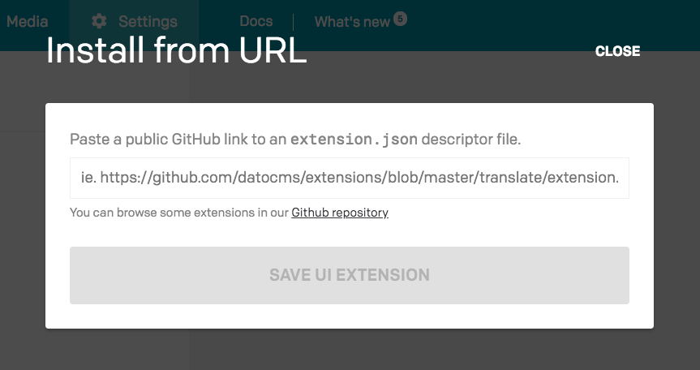

We want UI Extensions to be reused across multiple projects, so we made it easy to share them on GitHub and install them in new projects.

### Installing an existing extension

1. Navigate to *Settings > UI Extensions* in your project administrative area;
1. Hover the mouse on the plus button and select *Install from URL* ;
1. Enter a public GitHub link to an [`extension.json` manifest file](/docs/ui-extensions/manifest/) or select one from the [datocms/extensions](datocms/extensions) repository.




### `extension.json`

The `extension.json` file, also known as the *manifest file*, describes the properties of an extension.

If you plan to release your custom UI Extension on GitHub, remember to add the manifest file to the repository to make its installation on a DatoCMS project super-easy.

The following table describes the properties that can be set on the manifest file:

Property       | Required | Type           | Description
---------------|----------|----------------|------------
`name`         | yes      | String         | Extension name
`fieldTypes`   | yes      | Array<String>  | The kind of field types the extension can be used with
`extensionUrl` | yes      | String         | URL where the HTML entry-point of the extension can be found
`sidebar`      | no       | Boolean        | Controls the location of the extension. If true it will be rendered on the sidebar
`parameters`   | no       |                | [Configuration parameters]([configuration parameters](/docs/ui-extensions/configuration-parameters/)) for the extension

The `fieldTypes` property accepts the following values: `boolean`, `date`, `date_time`, `file`, `float`, `integer`, `string`, `text`, `lat_lon`, `json`, `seo`, `link`, `links`, `video`, `slug`, `gallery` and `color`.

Here is a complete example of an `extension.json` file:

```json
{
  "name": "Yandex translate",
  "extensionUrl": "https://rawgit.com/datocms/ui-extensions-sdk/master/examples/translate/index.html",
  "fieldTypes": ["string", "text"],
  "sidebar": false,
  "parameters": {
    "global": [
      {
        "id": "developmentMode",
        "label": "Development mode?",
        "type": "boolean",
        "hint": "Enable development logs on the console"
      },
      {
        "id": "yandexApiKey",
        "label": "Yandex API Key",
        "type": "string",
        "required": true,
        "hint": "The Yandex API Key to use (see https://tech.yandex.com/translate/)",
        "default": "trnsl.1.1.20151015T080754Z.fac48f0d13a96c3a.c0c58058288c42ba40de8aec2b36d9d86c3adb1d"
      }
    ],
    "instance": []
  }
}
```

